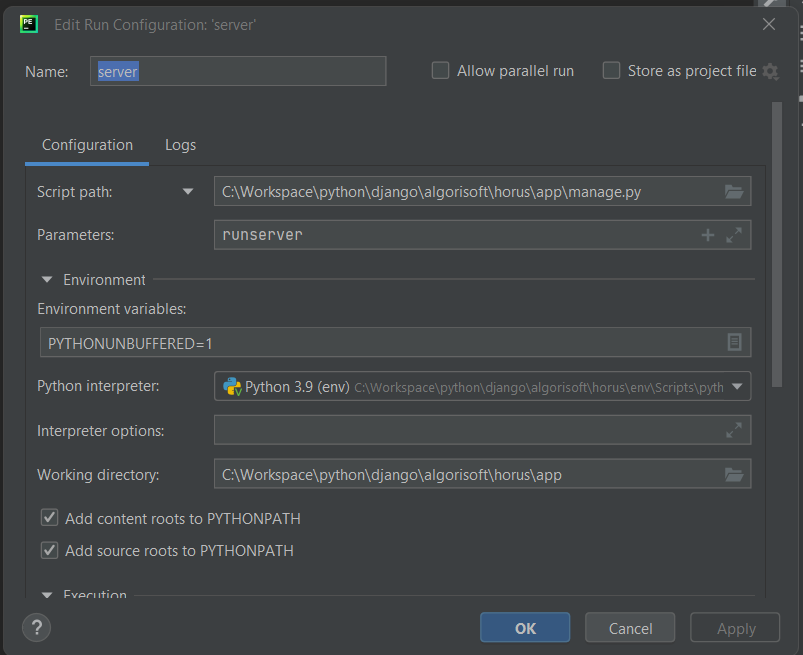

# Abrir un proyecto con PyCharm Community
### Crear workspace
### Crear entorno/ambiente de desarrollo
- python -m venv **<nombre_variable>**
- Activar entorno
- Instalar Django: pip install django
### Crear proyecto
- django-admin startproject **<nombre_proyecto>**
# Parametrizar el servidor en PyCharm Community

### Crear super usuario

- python manager.py createsuperuser 
